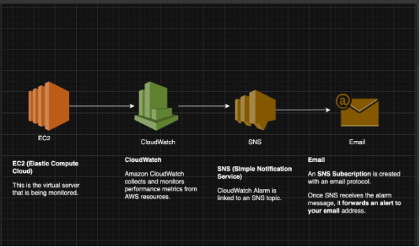

# EC2 Monitoring and Alerting with CloudWatch & SNS

## Project Overview

This project demonstrates how to configure **Amazon CloudWatch** and **Amazon SNS** to monitor an **EC2 instance's CPU utilization**. If CPU usage exceeds **60% for 6 minutes**, an **email alert** is sent using **SNS**.

> Implemented using **Terraform (IAC)** for reproducibility.

---


## Prerequisites

- AWS Account with appropriate permissions
- AWS CLI installed and configured
- Terraform installed (v0.12 or later)
- Git (optional, for cloning the repository)


## Project Structure

Monitoring-and-Alerting-for-EC2-Instance-Health/
                                    ├── main.tf                 # Terraform configuration
                                    ├── README.md               # Documentation
                                    ├── .gitignore              # Ignore Terraform files & secrets
                                    └── images/                 # Architecture diagram & screenshots
                                        ├── architecture.png
                                        ├── terraform-init.png
                                        ├── terraform-plan.png
                                        ├── terraform-apply.png
                                        ├── terraform-destroy.png


## Quick Start

### 1. Clone or Create the Project

```bash
git clone https://github.com/mangucletus/Monitoring-and-Alerting-for-EC2-Instance-Health.git
cd Monitoring-and-Alerting-for-EC2-Instance-Health
```

Or create a new directory and add the `main.tf` file manually.

### 2. Update Your Email Address

Edit the `main.tf` file and update the email address in the locals block:

```hcl
locals {
  email       = "your-email@example.com"  # Replace with your email
  group_name  = "group7"                  # You can keep this or change it
  cpu_threshold = 60
  alarm_period  = 360 # 6 minutes
}
```

### 3. Initialize Terraform

```bash
terraform init
```

### 4. Preview the Resources

```bash
terraform plan
```

### 5. Create the Resources

```bash
terraform apply
```

Type `yes` when prompted to confirm.

### 6. Confirm the SNS Subscription

Check your email inbox for a message from AWS Notifications and click the "Confirm subscription" link.

### 7. Wait for the Alarm

The EC2 instance is configured to run a stress test every 5 minutes, which will increase CPU usage and trigger the alarm after about 6-10 minutes.

### 8. Clean Up When Finished

To delete all resources and avoid unnecessary charges:

```bash
terraform destroy
```

Type `yes` when prompted.

## What This Project Creates

- **VPC** with public subnet, internet gateway, and routing
- **EC2 Instance** with stress test tool installed
- **IAM Role** with CloudWatch permissions for the EC2 instance
- **CloudWatch Alarm** that monitors CPU utilization
- **SNS Topic** with email subscription for alerts


## Architecture Flow Diagram

```text
     +-------------+         +----------------------+         +-------------------------+
     |  EC2        |  -----> | CloudWatch Alarm     | ----->  | SNS Topic               |
     | Instance    |         | (CPU > 60% for 6 min) |         | (group7-sns-topic)      |
     +-------------+         +----------------------+         +-------------------------+
                                                                    |
                                                                    v
                                                           mangucletus@gmail.com
                                                           (Email Notification)


---


##  Actual Architecture Diagram




## 🔧 Technologies Used

| Tool         | Purpose                           |
|--------------|-----------------------------------|
| Terraform    | Infrastructure as Code            |
| AWS EC2      | Virtual server                    |
| AWS SNS      | Sends email notifications         |
| AWS CloudWatch | Monitoring CPU usage             |

---


## Understanding the Components

### EC2 Instance

An Amazon Linux 2 t2.micro instance that runs a stress test every 5 minutes to simulate high CPU usage:

```hcl
resource "aws_instance" "group7_instance" {
  ami                    = "ami-0953476d60561c955"
  instance_type          = "t2.micro"
  # ... other configuration ...
  
  user_data = <<-EOF
    #!/bin/bash
    yum update -y
    yum install -y stress
    echo "*/5 * * * * stress --cpu 1 --timeout 300" | crontab -
  EOF
}
```

### CloudWatch Alarm

Monitors the EC2 instance's CPU utilization and triggers when it exceeds 60% for 6 minutes:

```hcl
resource "aws_cloudwatch_metric_alarm" "group7_cpu_alarm" {
  alarm_name          = "${local.group_name}-cpu-utilization-alarm"
  comparison_operator = "GreaterThanOrEqualToThreshold"
  evaluation_periods  = "1"
  metric_name         = "CPUUtilization"
  namespace           = "AWS/EC2"
  period              = local.alarm_period
  statistic           = "Average"
  threshold           = local.cpu_threshold
  # ... other configuration ...
}
```

### SNS Topic and Subscription

Creates an SNS topic and subscribes your email to receive notifications:

```hcl
resource "aws_sns_topic" "group7_sns_topic" {
  name = "${local.group_name}-cpu-alarm-topic"
}

resource "aws_sns_topic_subscription" "group7_email_subscription" {
  topic_arn = aws_sns_topic.group7_sns_topic.arn
  protocol  = "email"
  endpoint  = local.email
}
```

## Troubleshooting

### No Confirmation Email
- Check your spam/junk folder
- Verify the email address in `main.tf` is correct
- Make sure SNS service is available in your region

### Alarm Not Triggering
- Wait at least 15 minutes; CloudWatch metrics can take time to collect
- Verify the EC2 instance is running
- Check that the IAM role has proper CloudWatch permissions

### Terraform Errors
- Make sure AWS CLI is configured with proper credentials
- Check that you have permissions to create all required resources
- Try running `terraform init` again

## Next Steps

You can extend this project by:

1. Adding more metrics to monitor (memory, disk space, network)
2. Creating a CloudWatch dashboard
3. Adding automated remediation with Lambda functions
4. Integrating with other notification systems like Slack


## 👨‍💻 Author

- **Group**: `group7`
- **Email**: mangucletus@gmail.com
- **Region**: `us-east-1`

---


## Resources

- [AWS CloudWatch Documentation](https://docs.aws.amazon.com/cloudwatch/)
- [Terraform AWS Provider Documentation](https://registry.terraform.io/providers/hashicorp/aws/latest/docs)